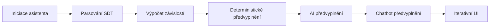
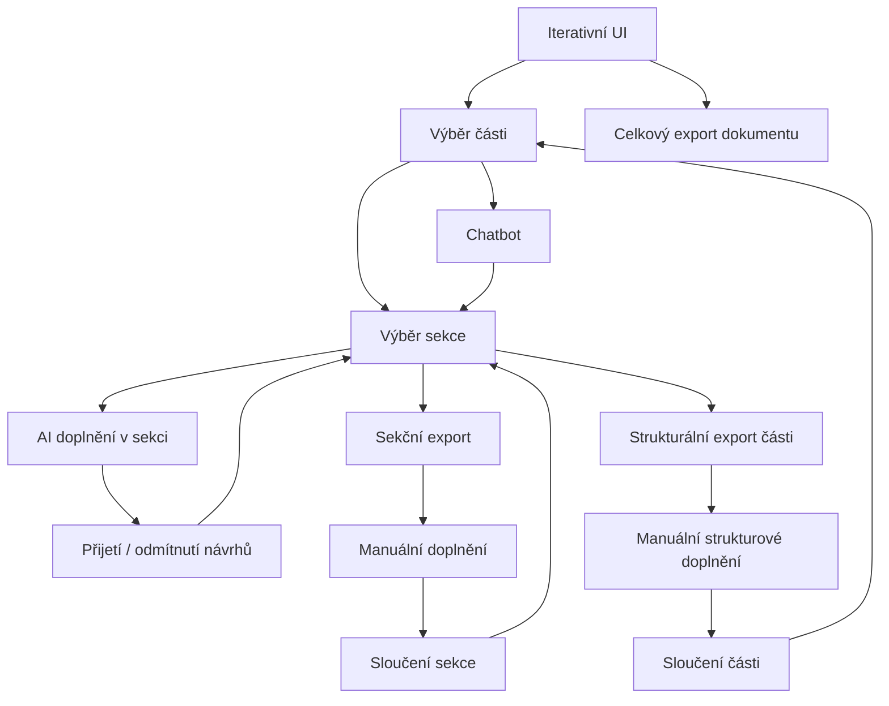

# Graf

## Inicializace

## Iterativní fáze

# 0. Šablona a stav asistenta

## Vstupní podmínky

* Asistent pracuje s verzovanou DOCX šablonou odpovídající formátu IK OVS.
* Všechny vyplnitelé pozice v šabloně jsou označeny SDT (content controls).
* Každé SDT nese stabilní interní tag podle alias mapy (např. `IKOVS_PREFACE_BASIC-INFO_INFO-TABLE`).
* Z těchto tagů se odvozují interní identifikátory polí, tabulek a sekcí (slouží jako primární klíče v interním modelu).
* Vnější bloky (kapitoly, podkapitoly) jsou zamčené proti uživatelským strukturálním změnám; 
* Před spuštěním proběhne validace: kontrola verze šablony proti alias mapě, přítomnost všech povinných tagů, nulová duplicita tagů.
* Pokud validace selže, inicializace se přeruší a vrátí se seznam chyb (chybějící/duplicitní tagy nebo nekompatibilní verze).

## Výstup inicializace 

* Validovaná šablona + seznam SDT tagů.
* Příprava prázdného interního JSON modelu

# 1) Načtení a základní vyplnení dokumentu

## 1) Inicializace

###  Vstupy a validace šablony

* Uživatelský vstup: ID alebo názov úradu.
* Backend načte verzovanou DOCX šablonu a ověří přítomnost SDT (content controls)

###  Parsování SDT → interní model

* Načtou se všechny SDT (content controls) obsažené v šabloně. Ověří se jejich přítomnost a základní validita.
* Vytvoří se interní JSON model
* Výstup: validovaná šablona, seznam SDT a prázdný interní model.

## 2) Výpočet závislostí a identifikace blokovaných/ready sekcí

### Graph závislostí

* Systém vypočítá závislosti mezi poli a sekcemi.
* Na základě těchto vztahů se sestaví jednoduchý dependency graf.
* Graf určuje, která pole vyžadují hodnoty z jiných částí dokumentu.
* Tento stav se průběžně aktualizuje při každé změně hodnot

## 3) Deterministické doplnění

### Co je deterministické

* Identifikační a evidenční údaje (název úřadu, IČO, sídlo, kontakty, identifikátory ISVS apod.).
* Tyto hodnoty se načítají pouze z důvěryhodných veřejných registrů a API.

### Postup doplnění

* Pro každý field v internal state označený pre `deterministic_fill` se spustí deterministický lookup z našich zdrojov.
* Pokud existuje jednoznačná hodnota, updatneme náš internal state touto hodnotou a správnymi metadatami.
* Každé deterministické doplnění generuje auditní záznam s informací o zdroji a hashe.

## 4) AI doplnění

* Pro každý field v internal state označený pre `AI_fill` a prázdne `deterministic_fill` se spustí vyplnenie s AI.
* Návrhy se **nepřepisují automaticky** hodnotám označeným jako deterministic nebo confirmed.

## 5) Chatbot doplnění (počáteční fáze)
* Po inicializaci může být spuštěn chatbot, který doplní vybrané hodnoty přímo od uživatele.
* Používají se pouze předem připravené otázky pro jednoduše získatelné údaje.
* Chatbot neprochází všechny položky označené jako chatbot_fill, ale pouze vybraný podmnožinu definovanou pro první iteraci.
* Odpovědi se ukládají do interního stavu a využívá se cache, aby se stejné otázky neopakovaly.
* Zbylá pole označená pro chatbot se doplní později při interaktivním zpracování jednotlivých sekcí.

# 2) Iterativní fáze - UI + akce

## Přehled kapitol

* Zobrazí se seznam kapitol s procentem vyplněnosti.
* Uživatel vybere kapitolu, se kterou chce pracovat.

## Seznam sekcí v kapitole

* Zobrazení menších sekcí v rámci kapitoly s jejich postupem.
* Uživatel otevře konkrétní sekci pro práci.

## Pracovní plocha sekce

* Zobrazí se všechna pole sekce s aktuální hodnotou a stavem.
* Akce u pole: **Regenerovat**, **Přijmout**, **Upravit**, **Odmítnout**.
* Akce u sekce: **Regenerovat vše**, **Akceptovat vše nad prahem**, **Exportovat sekci pro ruční vyplnění**.

## Blokované položky a závislosti

* U blokovaných polí se zobrazí přesné závislosti, které je blokují.
* Uživatel může přejít na pole blokující závislosti

## Pravidla chování

* Regenerovat spustí AI nebo deterministické doplnění pro jedno pole a uloží návrh jako `ai_proposal`.
* Akceptovat / Přijmout nastaví pole na `confirmed`. Odmítnout označí `rejected` a zachová historii.
* Změny okamžitě aktualizují procento vyplnění kapitoly a sekce.

## Chatbot doplnění v sekci

* Uživatel v otevřené sekci aktivuje chatbot.
* Pole označená `chatbot_fill` jsou kandidátní pro dotazování.
* Ke každému takovému poli existuje předdefinovaná sada otázek.
* Chatbot projde všechna `chatbot_fill` pole v sekci, položí připravené otázky a sbírá odpovědi.
* Potvrzené odpovědi se uloží do interního stavu jako `ai_interactive`.
* Odpovědi se cachují, aby se otázky neopakovaly.
* Chatbot vyplní vše, co může; zbytek zůstane `empty` nebo `needs_answer`.
* Všechny interakce jsou auditně zaznamenány (uživatel, čas, otázka, odpověď, cílový alias).

# 3} Iterativní fáze - Export a Merge

## Sekční exporty a merge

* Slouží k vyplnění konkrétních polí a následné aktualizaci interního stavu.
* Základní varianta: lineární formulář nevyplnených polí v jedné sekci
* Pokročilá varianta: do exportu lze přidat vybraná pole z jiných sekcí, pokud pomáhají vyřešit závislosti právě vyplňované sekce.

### Co export obsahuje

* Jeden Word dokument pro vyplnění textu a tabulek.
* Přiložený JSON s identifikátory polí, verzí šablony, kontrolním hashem a minimálními metadaty pro spárování.
* U každého pole krátká instrukce, co má uživatel vyplnit, případně příklad nebo formát, který je vhodné dodržet.
* Viditelné označení povinných položek a upozornění, pokud na poli závisí jiné části dokumentu.

### Merge zpět do asistenta

* Po importu se Word a JSON spárují podle stabilních identifikátorů a verze šablony.
* Nové hodnoty se zapíší do interního stavu, uloží se historie změn a auditní záznam.
* Systém zvýrazní změněná pole a přepočítá závislosti, aby se okamžitě projevilo odblokování navazujících položek.
* Potenciální problémy se zobrazí uživateli: chybějící povinné hodnoty, neplatný formát, atd.
* Po dokončení exportu a merge se v rozhraní zobrazí nově odblokované sekce a pole, které lze ihned generovat pomocí AI nebo doplnit ručně.
* Po úspěšném merge se aktualizuje postup sekce a kapitoly a lze pokračovat v iterativním vyplňování

## Chapter export (strukturální)

### Export

* Možnost Finální export části je dostupný v každé části
* Vytvoří se kopie šablony omezená na vybranou kapitolu a do všech SDT se injektuje aktuální interní stav.
* Exportuje se kapitola jako DOCX a přiložený JSON
* Uživatel doplní a upraví celou kapitolu v jejím rozsahu, včetně textů, tabulek a struktury.

### Merge

* Při importu se kapitola považuje za zdroj pravdy pro danou část dokumentu.
* Backend spáruje SDT, přečte hodnoty a aktualizuje interní stav včetně všech strukturálních změn.
* Kapitola se označí jako strukturálně sloučená. Pokud jsou všechna pole deterministická nebo potvrzená, kapitola je považována za dokončenou.

## Celkový export dokumentu

* Exportuje se jeden finální DOCX dokument.
* V první verzi není podporován zpětný merge.
* Kapitoly se stavem strukturálně sloučeno se berou jako zdroj pravdy.
* Kapitoly bez strukturálního exportu se vezmou z kopie šablony a do jejich SDT se injektuje aktuální interní stav.
* Výsledný dokument se složí spojením všech částí v pořadí daném šablonou.
* Uživatel je upozorněn, že externí úpravy tohoto výstupu se nevracejí zpět do asistenta.
* Opakovaný export je podporován

